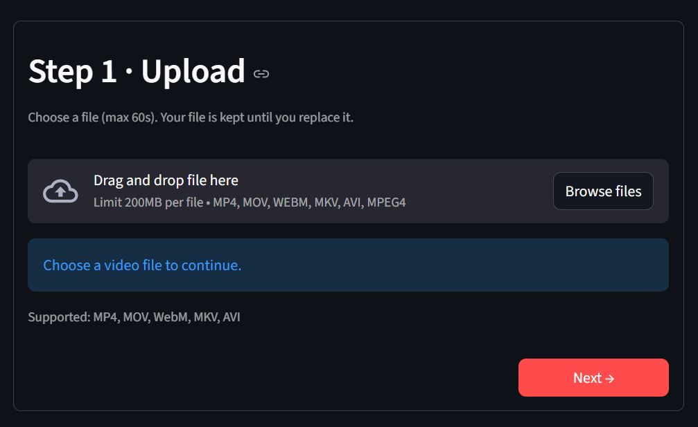
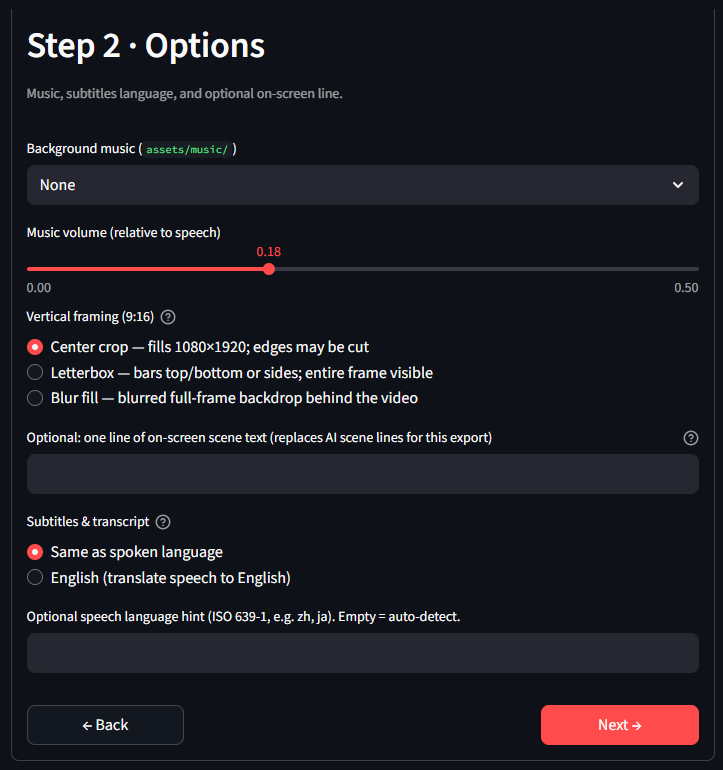
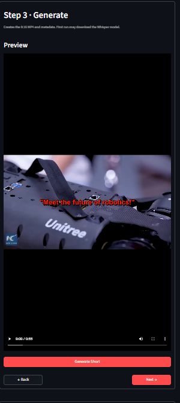
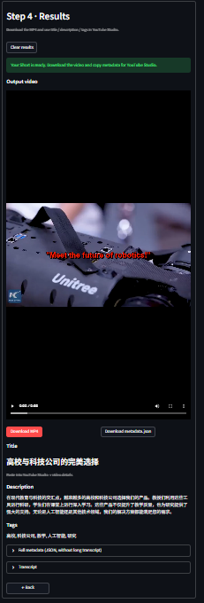

# ShortsAI-Studio

Turn a short clip (≤ **60s**) into a **1080×1920** YouTube Shorts–style MP4: **burned-in captions** (Whisper), optional **background music**, **GPT title/description/tags**, and **timed on-screen scene lines**. Use the **Streamlit** wizard or the **`shorts_generator.py`** CLI—the same pipeline powers both.

---

## Screenshots

**Step 1 · Upload** → **Step 2 · Options** → **Step 3 · Generate** → **Step 4 · Results**

|  |  |
|:---:|:---:|
| **1 · Upload** | **2 · Options** |

|  |  |
|:---:|:---:|
| **3 · Generate** | **4 · Results** |

*The images above are **color placeholders** so the README never shows broken links. Replace them with real UI captures when you polish the repo—see [`docs/screenshots/README.md`](docs/screenshots/README.md).*

---

## Features

| Area | What you get |
|------|----------------|
| **Speech → text** | [faster-whisper](https://github.com/SYSTRAN/faster-whisper) transcription; optional **translate-to-English** for subtitles + transcript |
| **Captions** | Timed **SRT** → burned into the export (FFmpeg `subtitles`) |
| **Vertical 9:16** | **Center crop** (default), **letterbox**, or **blur-fill** background (`boxblur` + overlay)—[`SHORTSAI_VERTICAL_FIT`](.env.example) or UI **Step 2** |
| **Music** | Mix a track from `assets/music/` under speech (volume slider / CLI `--music-volume`) |
| **Metadata** | JSON sidecar: title, description, tags, transcript, duration, `vertical_fit`, overlay source, etc. (`OPENAI_API_KEY` optional) |
| **Scene text** | Short **red timed drawtext** lines on the video (vision + GPT when a key is set; otherwise text fallback) |
| **Apps** | **Streamlit** (`app.py`): stepped flow, session **last export** (MP4 + meta). **CLI** (`shorts_generator.py`): same pipeline for demos, scripts, CI |

---

## Quick start

**Prerequisites:** Python **3.10+**, **`ffmpeg`** + **`ffprobe`** on `PATH` (or set paths in `.env`—see [Fix ffmpeg Error](#fix-ffmpeg-error)).

### 1. Clone, venv, dependencies

```bash
cd ShortsAI-Studio
python -m venv .venv
# Windows: .venv\Scripts\activate
# macOS/Linux: source .venv/bin/activate
python -m pip install --upgrade pip setuptools wheel
pip install -r requirements.txt
# Windows: copy .env.example .env
# macOS/Linux: cp .env.example .env
```

**Upgrade pip first** (above): very old venv pip can break installs (e.g. `tokenizers` / `pyproject.toml`). **Python 3.8** is not recommended; if you must use it, `requirements.txt` pins `tokenizers` for Windows wheels—still upgrade pip first. **Windows venv** can sit silent for a minute during `ensurepip`; do not Ctrl+C—if the venv breaks, delete `.venv` and recreate (see older README notes in git history if needed).

### 2. FFmpeg

```bash
ffmpeg -version && ffprobe -version
```

- **Windows:** `winget install Gyan.FFmpeg` — then **restart the terminal** so `PATH` updates.
- **macOS:** `brew install ffmpeg`
- **Linux (Ubuntu):** `sudo apt-get install ffmpeg`

### 3. Configure (optional)

Edit `.env` from [`.env.example`](.env.example):

- **`OPENAI_API_KEY`** — richer metadata + vision-based scene lines (optional; text fallbacks work without it).
- **`SHORTSAI_WHISPER_MODEL`** — `tiny` … `large-v3` (default `base`).
- **`SHORTSAI_WHISPER_TASK`** — `transcribe` vs **`translate`** (English subs for any speech).
- **`SHORTSAI_WHISPER_LANGUAGE`** — ISO 639-1 hint if auto-detect fails.
- **`SHORTSAI_WHISPER_DEVICE` / `SHORTSAI_WHISPER_COMPUTE`** — e.g. `cuda` + `float16`.
- **`SHORTSAI_VERTICAL_FIT`** — `crop` (default) \| `letterbox` \| `blur_fill`.
- **`SHORTSAI_FFMPEG_DIR`** or **`FFMPEG_PATH`** / **`FFPROBE_PATH`** — if Streamlit cannot find ffmpeg after install.

### 4. Run Streamlit

```bash
streamlit run app.py
```

Browser: **Upload** → **Options** (music, vertical framing, subtitles) → **Generate** → **Results** (download MP4 + JSON).

### 5. Run the CLI (same pipeline)

```bash
# Windows (PowerShell) — use venv Python
.\.venv\Scripts\python.exe shorts_generator.py -i path\to\your_clip.mp4
```

Outputs **`<stem>_shorts.mp4`** and **`<stem>_shorts.json`** next to the input (override with `-o` / `--metadata`). `python shorts_generator.py --help` parses without importing heavy deps (shows usage only).

```bash
.\.venv\Scripts\python.exe shorts_generator.py --list-music
.\.venv\Scripts\python.exe shorts_generator.py -i clip.mp4 -o out/demo.mp4 --music first
.\.venv\Scripts\python.exe shorts_generator.py -i clip.mp4 --translate --language-hint zh
.\.venv\Scripts\python.exe shorts_generator.py -i clip.mp4 --vertical-fit blur_fill
.\.venv\Scripts\python.exe shorts_generator.py -i clip.mp4 --keep-work-dir -q
```

`--vertical-fit` overrides **`SHORTSAI_VERTICAL_FIT`** for that run. **`--music first`** uses the first sorted file in `assets/music/`.

**One-shot checklist:** `ffmpeg`/`ffprobe` OK → run CLI or Streamlit on a clip under 60s → confirm MP4 + captions (if speech) + optional music + JSON metadata.

---

## Background music (YouTube Audio Library)

Use tracks from the **[YouTube Studio Audio library](https://studio.youtube.com)** so licensing matches Shorts.

1. YouTube Studio → **Audio library** → download (e.g. MP3).
2. Put files in **`assets/music/`** (see that folder’s README).

Some tracks need **attribution** in the description—copy the required credit into your published description or the generated JSON as needed.

---

## Fix ffmpeg error

If you see **"Could not find ffmpeg and ffprobe"** (common right after `winget install` before the IDE picks up `PATH`):

**Option A — restart terminal** after install, then `ffmpeg -version`.

**Option B — `.env`** (folder must contain **both** binaries):

```
SHORTSAI_FFMPEG_DIR=C:\ffmpeg\bin
```

Or per-executable: `FFMPEG_PATH`, `FFPROBE_PATH`. WinGet shims often live under  
`%LOCALAPPDATA%\Microsoft\WinGet\Links` (both `.exe` there on many setups).

---

## Repo layout (high level)

| Path | Role |
|------|------|
| `app.py` | Streamlit UI |
| `shorts_generator.py` | CLI entry |
| `shortsai/pipeline.py` | End-to-end export |
| `shortsai/ffmpeg_util.py` | ffmpeg/ffprobe helpers |
| `assets/music/` | Optional background tracks |
